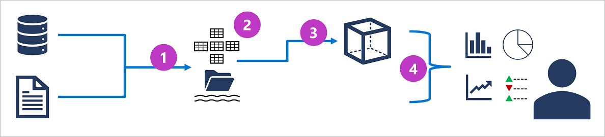

# Explore core data concepts
## Explore core data concepts
### Introduction
- Data generation has increased significantly, with diverse structures and formats.  
- Collecting and storing data is now easier and more affordable.  
- Data is a valuable business asset, enabling critical decision-making when analyzed properly.  
- Organizations require the ability to capture, store, and analyze data.  
- This module introduces data representation, storage options, and workloads.  
- It provides a foundation for learning data techniques and services.  

### Identify data formats
- **Structured data**
    - Adheres to a fixed schema.
    - Representable in tables.
    - Rows = instances, Columns = attributes.
    - Relational model can be used.

- **Semi-structured data**
    - Schema
    - Some fields may have different schema
    - E.g. Json

- **Unstructured data**
    - Audio, video, binary, documents, etc

- **Data stores**
    - Two most common store are 
        - File stores
        - Databases

### Explore file storage
- **File Storage Overview**: Core to computing systems, files can be stored locally or in shared systems, increasingly hosted in the cloud for cost-effective, secure, and reliable storage.  
- **Delimited Text Files**: Use delimiters like commas (CSV) or tabs (TSV) for structured data; human-readable and widely supported.  
- **JSON**: A flexible, hierarchical format for structured and semi-structured data, using name-value pairs and collections.  
- **XML**: Human-readable, tag-based format; largely replaced by JSON but still used in some systems.  
- **BLOB**: Raw binary data for unstructured formats like images and video, requiring specific applications for interpretation.  
- **Optimized Formats**:  
  - **Avro**: Row-based with JSON headers; efficient for compression and network use.  
  - **ORC**: Columnar, optimized for Apache Hive; includes data and statistical metadata.  
  - **Parquet**: Columnar, efficient for nested data and supports advanced compression.  

### Explore databasey  
- **Databases**: Central systems for storing and querying data, distinct from file systems in professional contexts.  
- **Relational Databases**:  
  - Store structured data in tables (entities) with unique primary keys.  
  - Use normalization to eliminate data duplication.  
  - Managed with ANSI-standard SQL.  
- **Non-relational Databases (NoSQL)**:  
  - **Key-Value**: Records have unique keys and associated values in any format.  
  - **Document**: A type of key-value database optimized for JSON documents.  
  - **Column-Family**: Tabular data organized into logical column groups.  
  - **Graph**: Nodes represent entities, and links define their relationships.

### Explore transactional data processing
- **Purpose**: Records specific organizational events (e.g., financial transactions or retail payments).  
- **Characteristics**:  
  - Handles high-volume transactions.  
  - Requires fast access to data for Online Transactional Processing (OLTP).  
- **CRUD Operations**: Data is created, retrieved, updated, and deleted while maintaining integrity.  
- **ACID Principles**:  
  - **Atomicity**: Transactions fully succeed or fail.  
  - **Consistency**: Data transitions between valid states.  
  - **Isolation**: Concurrent transactions don't interfere.  
  - **Durability**: Committed transactions persist permanently.  
- **Usage**: Supports live, business-critical applications (LOB systems). 

### Explore analytical data processing

- **Purpose**: Analyzes vast volumes of historical or business metric data, often in snapshots.  
- **Architecture**:  
  1. **ETL**: Extract, transform, and load operational data into a data lake.  
  2. **Data Storage**: Use a Spark-based data lakehouse or data warehouse for tabular data.  
  3. **OLAP Models**: Aggregate measures across dimensions for fast, hierarchical analysis.  
  4. **Output**: Data queried for reports, dashboards, and visualizations.  
- **Components**:  
  - **Data Lakes**: Flexible, large-scale file-based data storage.  
  - **Data Warehouses**: Relational, optimized for queries and reporting.  
  - **Lakehouses**: Combine data lake scalability with warehouse querying.  
  - **OLAP Models**: Pre-aggregated data for fast, multidimensional analysis.  
- **Users**:  
  - **Data Scientists**: Explore data in lakes.  
  - **Data Analysts**: Query warehouses for reports.  
  - **Business Users**: Consume pre-aggregated data via dashboards.  

## Explore data roles and services
### Explore job role sin the world of data
- **Overview**: Data roles vary across business, engineering, research, and hybrid tasks. Key roles focus on specific responsibilities, though some may overlap in smaller organizations.  
- **Key Roles**:  
  - **Database Administrator**:  
    - Manages database design, performance, security, and backups.  
    - Ensures data availability, grants access, and supports disaster recovery.  
  - **Data Engineer**:  
    - Designs and implements data pipelines, ingestion, transformation, and storage.  
    - Maintains privacy, ensures pipeline performance, and integrates on-premises with cloud systems.  
  - **Data Analyst**:  
    - Explores data for trends, creates analytical models, and delivers insights via reports and visualizations.  
    - Transforms raw data into actionable insights based on business needs.  
- **Additional Roles**: Other professionals like data scientists, architects, and software engineers also contribute to data management.  

### Identify data services
- **Azure SQL**: Relational database options, including fully managed services (SQL Database), hosted SQL Server instances (Managed Instance), and customizable virtual machines (SQL VM). Supports transactional workloads, ETL pipelines, and reporting.  
- **Open-source Databases**: Managed services for MySQL, MariaDB, and PostgreSQL; support transactional applications and analytical pipelines.  
- **Azure Cosmos DB**: Global-scale NoSQL database for JSON, key-value, column-family, and graph data. Often managed by developers for flexible data models.  
- **Azure Storage**: Core storage options for blobs, file shares, and key-value tables. Used for data lakes with hierarchical organization.  
- **Azure Data Factory**: Enables ETL pipeline creation for data ingestion, transformation, and storage.  
- **Microsoft Fabric**: Unified SaaS platform for data ingestion, analytics, AI insights, and governance.  
- **Azure Databricks**: Spark-based analytics for large-scale data, supporting data queries, visualization, and transformation.  
- **Azure Stream Analytics**: Real-time stream processing for ingesting and analyzing live data streams.  
- **Azure Data Explorer**: High-performance platform for querying log and IoT telemetry data.  
- **Microsoft Purview**: Enterprise-wide data governance, tracking lineage, and ensuring trustworthy analytical data.  

# [Next](./2-explore-relational-data-in-azure.md)
